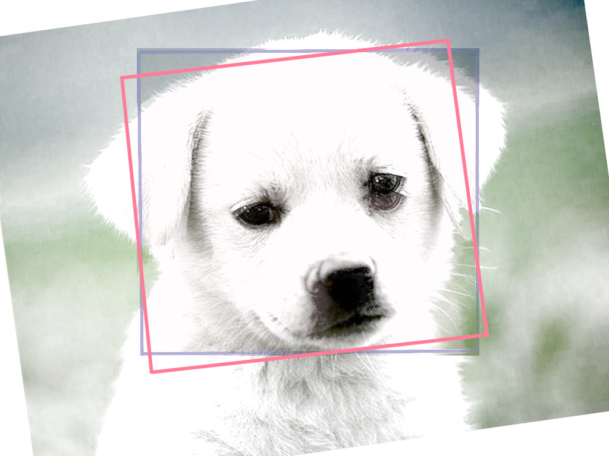

## COCO Evaluator used with Image Augmentation

COCO Evaluator contains bounding box measurements involving mAP. The example here uses Detection Bounding Boxes applied using COCO Evaluator.

The `pycocotools` does an evaluation on categorical variables using grid search done on Intersection Over Union (IOU) metrics. 

## Intersection Over Union (IoU)



```bash
IoU =       Area of Overlap
      ---------------------------
      Area of Union of two images
```

Sample output of the mAP is given below:

```python

 DetectionBoxes_Precision/mAP': 1.5104485276902977e-07
 DetectionBoxes_Precision/mAP (large)': 4.6072545830664966e-07
 DetectionBoxes_Precision/mAP (medium)': 0.0
 DetectionBoxes_Precision/mAP (small)': 0.0
 DetectionBoxes_Precision/mAP@.50IOU': 1.5104485276902977e-06
 DetectionBoxes_Precision/mAP@.75IOU': 0.0
 DetectionBoxes_Recall/AR@1': 0.0
 DetectionBoxes_Recall/AR@10': 0.0
 DetectionBoxes_Recall/AR@100': 0.00016863406408094435
 DetectionBoxes_Recall/AR@100 (large)': 0.00024213075060532688
 DetectionBoxes_Recall/AR@100 (medium)': 0.0
 DetectionBoxes_Recall/AR@100 (small)': 0.0

```

## Command line

```bash

from coco_detection_evaluator import CocoDetectionEvaluator
evaluator = CocoDetectionEvaluator()
try:
    evaluator.add_single_ground_truth_image_info(ground_truth_image, ground_truth_dicts)
    evaluator.add_single_detected_image_info(detection_image, detect_dicts)
except Exception as e:
    raise e

```
